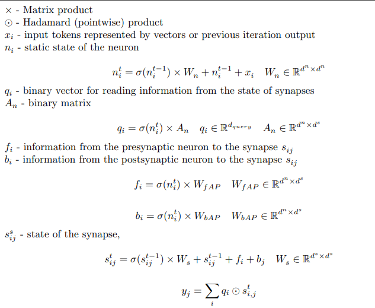

# Spiking-Neural-Network-With-Synaptic-Plasticity
PyTorch implementation of spiking neural network with synaptic plasticity

The main idea is to represent the neuron and synapses as recurrent neural networks interacting with
each other

